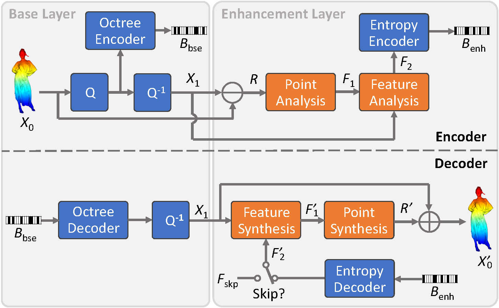
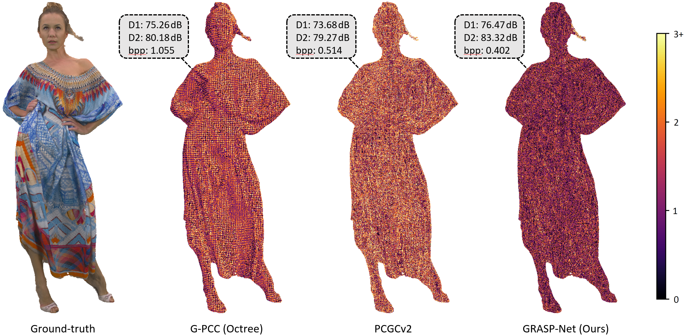

 # GRASP-Net: Geometric Residual Analysis and Synthesis for Point Cloud Compression
Created by Jiahao Pang, Muhammad Asad Lodhi and Dong Tian from <a href="https://www.interdigital.com/" target="_blank">InterDigital</a>.

<p align="center">
    
</p>

## Introduction

This repository contains the implementation of the [GRASP-Net](https://arxiv.org/pdf/2209.04401.pdf) paper accepted in the ACM MM 2022 Workshop on APCCPA. 3D point clouds are locally sparse, which makes it difficult to capture the correlation among neighboring points for point cloud compression (PCC). To address this issue, we proposed GRASP-Net, a heterogeneous framework for AI-based PCC, which combines both convolutional layers and native point-based networks to effectively compress the geometry of an input point cloud in a lossy manner. Experimentation on both dense and sparse point clouds demonstrate the state-of-the-art compression performance achieved by our proposal. Our GRASP-Net is implemented based on the [PccAI](https://github.com/InterDigitalInc/PccAI) (*pick-kai*) framework—a PyTorch-based framework for conducting AI-based PCC experiments.

## Installation

We tested our implementation under two different virtual environments with conda:
* Python 3.6, PyTorch 1.7.0, and CUDA 10.1. For this configuration, please launch the installation script `install_torch-1.7.0+cu-10.1.sh` with the following command:
```bash
echo y | conda create -n grasp python=3.6 && conda activate grasp && ./install_torch-1.7.0+cu-10.1.sh
```
* Python 3.8, PyTorch 1.8.1, and CUDA 11.1. For this configuration, please launch the installation script `install_torch-1.8.1+cu-11.2.sh` with the following command:
```bash
echo y | conda create -n grasp python=3.8 && conda activate grasp && ./install_torch-1.8.1+cu-11.2.sh
```
It is *highly recommended* to check the installation scripts which describe the details of the necessary packages. Note that [torchac](https://github.com/fab-jul/torchac) is used for arithmetic coding and [plyfile](https://github.com/dranjan/python-plyfile) is used for the reading/writing of PLY files. These two packages are under GPL license. By replacing them with another library providing the same functionality, our implementation can still run.

After that, put the binary of [`tmc3`](https://github.com/MPEGGroup/mpeg-pcc-tmc13) (MPEG G-PCC) and `pc_error` (D1 & D2 computation tool used in the MPEG group) under the `third_party` folder. A publicly-available version of `pc_error` can be found [here](https://github.com/NJUVISION/PCGCv2/blob/master/pc_error_d). To use it for the benchmarking of GRASP-Net, please download and rename it to `pc_error`.

## Datasets
Create a `datasets` folder then put all the datasets below. One may create soft links to the existing datasets to save space.
### Ford Sequences

The GRASP-Net uses the first *Ford* sequences for training and the other two sequences for benchmarking. They are arranged as follows:
```bash
${ROOT_OF_THE_REPO}/datasets/ford
                               ├── ford_01_q1mm
                               ├── ford_02_q1mm
                               └── ford_03_q1mm
                                       ├── Ford_03_vox1mm-0200.ply
                                       ├── Ford_03_vox1mm-0201.ply
                                       ├── Ford_03_vox1mm-0202.ply
                                       ...
                                       └── Ford_03_vox1mm-1699.ply
```

### ModelNet40

The GRASP-Net uses ModelNet40 to train for the case of surface point clouds. Our ModelNet40 data loader is built on top of the loader of PyTorch Geometric. For the first run, it will automatically download the ModelNet40 data under the `datasets` folder and preprocess it. 

### Surface Point Clouds

The test set of the surface point clouds should be organized as shown below. Note that the point clouds are selected according to the MPEG recommendation [w21696](https://www.mpeg.org/wp-content/uploads/mpeg_meetings/139_OnLine/w21696.zip).
```bash
${ROOT_OF_THE_REPO}/datasets/cat1
                               ├──A
                               │  ├── soldier_viewdep_vox12.ply
                               │  ├── boxer_viewdep_vox12.ply
                               │  ├── Facade_00009_vox12.ply
                               │  ├── House_without_roof_00057_vox12.ply
                               │  ├── queen_0200.ply
                               │  ├── soldier_vox10_0690.ply
                               │  ├── Facade_00064_vox11.ply
                               │  ├── dancer_vox11_00000001.ply
                               │  ├── Thaidancer_viewdep_vox12.ply
                               │  ├── Shiva_00035_vox12.ply
                               │  ├── Egyptian_mask_vox12.ply
                               │  └── ULB_Unicorn_vox13.ply
                               └──B
                                  ├── Arco_Valentino_Dense_vox12.ply
                                  └── Staue_Klimt_vox12.ply
```
Note that the file names are case-sensitive. Users may also put other surface point clouds in the `cat1/A` or `cat1/B` folders for additional testing.

## Basic Usages

The core of the training and benchmarking code are put below the `pccai/pipelines` folder. They are called by their wrappers below the `experiments` folder. The basic way to launch experiments with PccAI is:
 ```bash
 ./scripts/run.sh ./scripts/[filename].sh [launcher] [GPU ID(s)]
 ```
where `launcher` can be `s` (slurm), `d` (direct, run in background) and `f` (direct, run in foreground). `GPU ID(s)` can be ignored when launched with slurm. The results (checkpoints, point cloud files, log, *etc.*) will be generated under the `results/[filename]` folder. Note that multi-GPU training/benchmarking is not supported by GRASP-Net.

### Training

Take the training on the Ford sequences as an example, one can directly run
 ```bash
./scripts/run.sh ./scripts/train_grasp/train_lidar_ford/train_lidar_ford_r01.sh d 0
 ```
which trains the model of the first rate point when operating on the Ford sequences. The trained model will be generated under the `results/train_lidar_ford_r01` folder. Note that all the models for the five rate points should be trained to have the complete R-D curves. Please follow the same way to train the models for other datasets. All the training scripts are provided under the `scripts/train_grasp` folder.

To understand the meanings of the options in the scripts for benchmarking/training, refer to `pccai/utils/option_handler.py` for details.

 ### Benchmarking

The trained models of GRASP-Net are released [here](https://www.dropbox.com/s/80z19597tcpfdqn/grasp-net_models_20220919.zip?dl=0). Please put the downloaded folders `grasp_surface_solid`, `grasp_surface_dense`, `grasp_surface_sparse`, and `grasp_lidar_ford` right beneath the `results` folder. Then to benchmark the performance on the Ford sequences, one can directly run
 ```bash
./scripts/run.sh ./scripts/bench_grasp/bench_lidar_ford/bench_lidar_ford_all.sh d 0
 ```
which benchmarks all the rate points on GPU #0 and generates the statistics for each rate point in the CSV file `results/bench_lidar_ford_all/mpeg_report.csv`.

Alternatively, one can use the following command lines for benchmarking the five rate points individually, followed by merging the generated CSV files:
 ```bash
for i in {1..5}
do
   ./scripts/run.sh ./scripts/bench_grasp/bench_lidar_ford/bench_lidar_ford_r0$i.sh f 0
done
python ./utils/merge_csv.py --input_files ./results/bench_lidar_ford_r01/mpeg_report.csv ./results/bench_lidar_ford_r02/mpeg_report.csv ./results/bench_lidar_ford_r03/mpeg_report.csv ./results/bench_lidar_ford_r04/mpeg_report.csv ./results/bench_lidar_ford_r05/mpeg_report.csv --output_file ./results/grasp_lidar_ford/mpeg_report.csv
 ```
All the benchmarking scripts for different categories of point clouds are provided under the `scripts/bench_grasp` folder.

BD metrics and R-D curves are generated via the *AI-PCC-Reporting-Template* with [commit 01a6857](https://github.com/yydlmzyz/AI-PCC-Reporting-Template/tree/01a68579f04b4741de77b193f168d730456cf0d6). For example, run the following command right beneath its repository:
```bash
python test.py --csvdir1='csvfiles/reporting_template_lossy.csv' --csvdir2='/PATH/TO/mpeg_report.csv' --csvdir_stats='csvfiles/reporting_template_stats.csv' --xlabel='bppGeo' --ylabel='d1T'
```
It can also generate the average results for a certain point cloud category:
```bash
python test_mean.py --category='am_frame' --csvdir1='csvfiles/reporting_template_lossy.csv' --csvdir2='/PATH/TO/mpeg_report.csv' --csvdir_stats='csvfiles/reporting_template_stats.csv' --xlabel='bppGeo' --ylabel='d1T'
```

Replace `d1T` with `d2T` for computing the D2 metrics. The benchmarking of surface point clouds can be done in the same way. Example R-D curves and the results of all rate points of GRASP-Net are placed under the `assets` folder.

## Cite This Work
Please cite our work if you find it useful for your research:
```
@article{pang2022grasp,
  title={GRASP-Net: Geometric Residual Analysis and Synthesis for Point Cloud Compression},
  author={Pang, Jiahao and Lodhi, Muhammad Asad and Tian, Dong},
  bookitle={ACM MM Workshop on APCCPA},
  year={2022}
}
```
## License
GRASP-Net is released under the BSD License, see `LICENSE` for details.

## Contacts
Please contact Jiahao Pang (jiahao.pang@interdigital.com), the main contributor of both GRASP-Net and PccAI, if you have any questions.

## Related Resources
 * [PccAI](https://github.com/InterDigitalInc/PccAI)
 * [3D Point Capsule Networks](https://github.com/yongheng1991/3D-point-capsule-networks)
 * [MinkowskiEngine](https://github.com/NVIDIA/MinkowskiEngine)
 * [PCGCv2](https://github.com/NJUVISION/PCGCv2/)
 * [AI-PCC-Reporting-Template](https://github.com/yydlmzyz/AI-PCC-Reporting-Template)
 * [TMC13](https://github.com/MPEGGroup/mpeg-pcc-tmc13)

<p align="center">
     
</p>